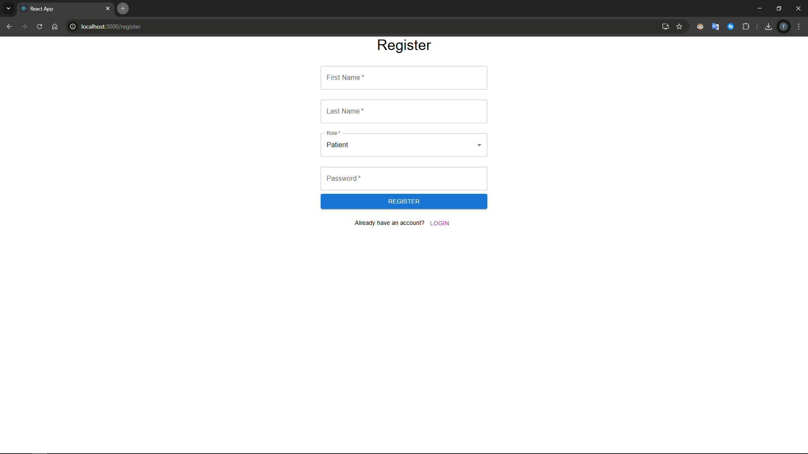

# SymptoFlow

## Overview

**SymptoFlow** is a **medical assistant chatbot** designed to support breast cancer patients throughout their treatment
journey. It leverages a **vector database** containing **dozens of research papers** collected from the internet to
provide accurate and relevant medical insights.

Additionally, both **patients and doctors can continuously input medical records**, which are timestamped and stored.
When interacting with the chatbot, patients benefit not only from the latest research but also from their own medical
history. The system distinguishes between **records entered by the patient and those entered by the doctor**, ensuring
that medical recommendations are **personalized and informed by professional insights**.

The system is designed to be **easily adaptable to other diseases**. By modifying the **system prompt and feeding it
different medical literature**, the pipeline can be customized for various medical conditions.

This capability makes SymptoFlow a valuable tool for **patients in remote or underserved areas**, providing them with an
**AI-powered assistant for medical guidance** while enabling doctors to monitor their condition remotely.

### Multi-Agent System

SymptoFlow employs a **multi-agent system** to enhance the chatbot's capabilities:

- One agent is responsible for **answering user questions** based on vectorized medical knowledge and patient records.
- Another agent **generates meaningful titles for conversations**, ensuring better organization and referenceability.

This structure allows for **efficient question handling and improved chat management**, ensuring users can easily navigate their past interactions.

---

## Features & Goals

- **Seamless Integration**: Easily adaptable for different diseases by modifying the system prompt and medical dataset.
- **Comprehensive Medical Assistant**: Provides patients with science-backed advice based on up-to-date research.
- **Patient & Doctor Record System**: Stores timestamped medical records from both patients and doctors.
- **Doctor-Patient Record Distinction**: The chatbot differentiates between records entered by patients and those by
  doctors to ensure accurate recommendations.
- **Remote Patient Support**: Helps patients in underserved regions access critical medical information and enables
  remote monitoring by doctors.
- **Multi-Agent Architecture**: One agent answers user questions while another generates structured conversation titles.
- **Scalability**: Can be expanded for different medical fields by updating the vector database and prompt.

---

## Tech Stack

- **Backend**: Python, Flask, LangChain
- **Database**: MySQL, Vector Database (FAISS)
- **Frontend**: React, Material UI

---

## Setup

### 1. Requirements

- Python 3.9+
- Node.js 16+
- MySQL

### 2. Clone the Repository

```sh
git clone https://github.com/tarikalim/SymptoFlow.git
cd SymptoFlow
```

### 3. MySQL Setup

Please download docker to setup MySQL server if you don't.

Linux:

```sh
sudo docker run -d --name sympoto_db \
  -e MYSQL_ROOT_PASSWORD=sympto_root_password \
  -e MYSQL_DATABASE=sympto \
  -e MYSQL_USER=sympto \
  -e MYSQL_PASSWORD=sympto_password \
  -p 3306:3306 \
  mysql:latest
```
Windows:

```sh
docker run -d --name sympoto_db `
  -e MYSQL_ROOT_PASSWORD=sympto_root_password `
  -e MYSQL_DATABASE=sympto `
  -e MYSQL_USER=sympto `
  -e MYSQL_PASSWORD=sympto_password `
  -p 3306:3306 `
  mysql:latest
```

### 4. Backend Setup

Download python if you don't:
https://www.python.org/downloads/

```sh
cd SymptoFlow
python -m venv .venv
source .venv/bin/activate  # For Windows: .venv\Scripts\activate
pip install -r requirements.txt
```

Create a `.env` file and define the necessary environment variables that provided in example.env.

Start the backend (from the SymptoFlow directory):

```sh
python -m backend.app
```

### 5. Frontend Setup

Download the node.js if you don't:
https://nodejs.org/en/download

```sh
cd frontend
npm install
npm start
```

## 6. UI Images

### **Login**


### **Registration**



### **Adding Record**


### **View Records**


### **Chat Screen 1**


### **Chat Screen 2**


### **Patient Dashboard**


### **Doctor Dashboard**


